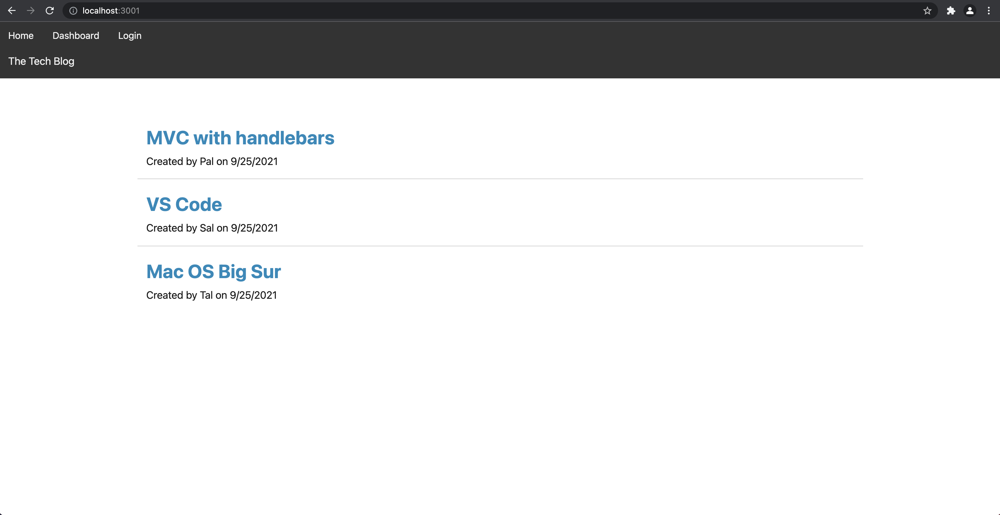

# Homework 14 - Tech Blog

## Table of Contents
  
1. [Description](#description)
2. [Installation](#installation)
3. [Usage](#usage)
4. [License](#license)
5. [Contributing Guidelines](#contributing-guidelines)
6. [Test Instructions](#test-instructions)
7. [Questions](#questions)
  
## Description

*  A CMS-style blog site similar to a Wordpress site, where developers can publish their blog posts and comment on other developers’ posts as well. Follows the MVC paradigm in its architectural structure, using Handlebars.js as the templating language, Sequelize as the ORM, and the express-session npm package for authentication.

## Installation

* Clone the repository, install dependencies, create database using schema.sql file wiht command "source schema.sql", seed using command "npm run seed", start server using "npm start"

## Usage

## License
  
* MIT
  
## Contributing Guidelines

* Fork the repository, commit contributions, then create a pull request.

## Test Instructions

* Fork the repository, create tests, then submit an issue. 
  
## Questions

Contact information for questions:

* Email: taylor@newengood.com
* Github: https://github.com/newengood
  
  